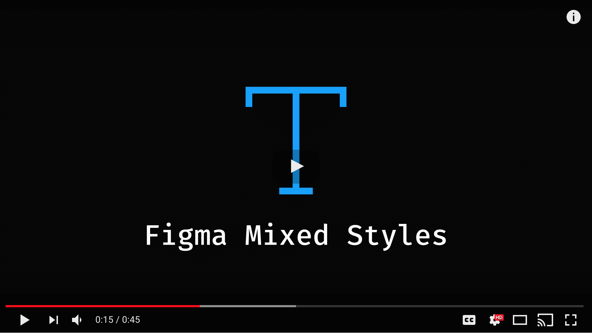

# Figma Mixed Styles Extension

[comment]: <> (![Chrome Web Store]&#40;https://img.shields.io/chrome-web-store/v/lfofpannpmmeeicgiiacjghmcfgnebbi?label=Chrome%20Web%20Store&#41; )

Extract CSS of Figma text nodes with mixed styles, even in “View only” mode.

Supported browsers: Chrome, Firefox, and any Chromium-based browser (Edge, Opera, Yandex.Browser, etc).

[По-русски](./README.ru.md)

[comment]: <> ([![Figma Search in Chrome Web Store]&#40;./add-to-chrome.svg&#41;]&#40;https://chrome.google.com/webstore/detail/figma-search/lfofpannpmmeeicgiiacjghmcfgnebbi&#41;)

## Rationale

Currently Figma does not have such a built-in option. Maybe it's possible to figure out complex styles using plugins,
but they do not work it “View only” mode.

So this plugin was built as a temporary solution, until the time when Figma developers implement native search.

## How to install

### Chrome Web Store

Soon.

[comment]: <> (If you use Chrome or any Chromium-based browser &#40;Edge, Opera, Yandex.Browser, etc&#41; it's easy to install )

[comment]: <> (the extension from the official store:)

[comment]: <> (**[Figma Search]&#40;https://chrome.google.com/webstore/detail/figma-search/lfofpannpmmeeicgiiacjghmcfgnebbi&#41; in Crome Web Store**)

[comment]: <> (Just click on the link above and press “Add to Chrome”.)

### Firefox Add-ons

If you use Mozilla Firefox, then install the extension from the official store:

**[Figma Mixed Styles](https://addons.mozilla.org/en-US/firefox/addon/figma-mixed-styles/) in Firefox Browser Add-ons**

Open the link above and press “Add to Firefox”.

### Manual installation

#### Chrome or other Chromium-based browser

1. [Download the latest release](https://github.com/igoradamenko/figma-mixed-styles-extension/releases).
2. Unpack the downloaded archive somewhere, where you won't remove it accidentally.
3. Open `chrome://extensions` in your browser.
4. Enable “Developer mode” (usually it looks like a radio-button in a corner of the page).
5. Press “Load unpacked” button (appears only in developer mode).
6. Select the folder with the unpacked extension (from 2nd step). 
7. Reload Figma pages that had been open before you installed the extension, and you're ready to go.

Your browser may throw you alerts after restart, which say that this extension is not trusted or something.
But that's the price for installing an extension directly from the sources.

#### Firefox

If you use Windows or macOS, you have to install [Firefox Developer Edition](https://www.mozilla.org/ru/firefox/developer/)
or [Firefox Nightly](https://www.mozilla.org/ru/firefox/channel/desktop/#nightly). It's impossible to install unpacked
extension permanently into a regular Firefox.

If you use Linux or have already installed one of those editions, then:

1. [Download the latest release](https://github.com/igoradamenko/figma-mixed-styles-extension/releases).
2. Open `about:config` and accept the risk, find variable `xpinstall.signatures.required` and set it to `false`.
3. Open `about:addons`, press on a settings icon and pick “Install Add-on From File...” from a dropdown menu.
4. Select the downloaded ZIP extension (from 1st step).
5. Approve an installation.

## More

- **[Figma Search Extension](https://github.com/igoradamenko/figma-search-extension)**

